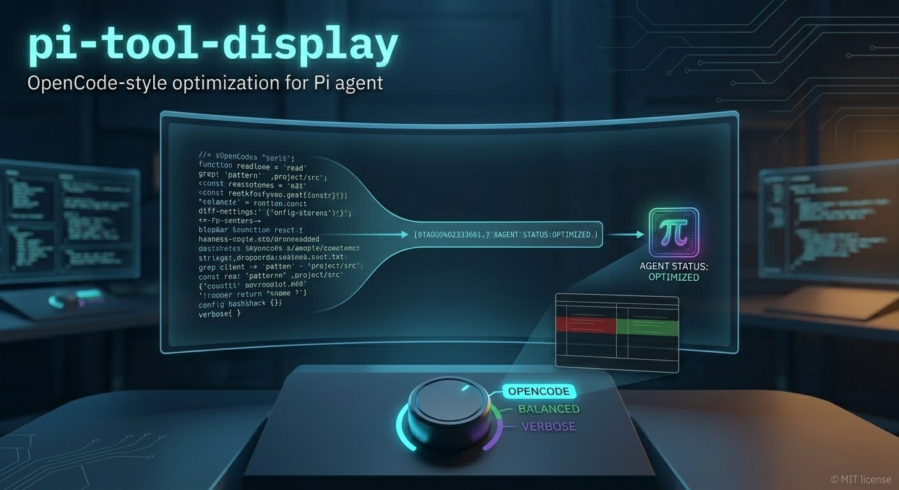

# pi-tool-display

OpenCode-style tool rendering for the Pi coding agent.

`pi-tool-display` overrides built-in tool renderers so tool calls/results stay compact by default, with optional previews and richer diffs when you need detail.



## Features

- Compact rendering for `read`, `grep`, `find`, `ls`, `bash`, `edit`, and `write`
- Presets for output verbosity: `opencode`, `balanced`, `verbose`
- Interactive settings modal via `/tool-display`
- Command-based controls (`show`, `reset`, `preset ...`)
- Diff renderer with adaptive split/unified mode and inline highlights
- Optional truncation and RTK compaction hints
- Native bordered user message box styling

## Installation

### Local extension folder

Place this folder in:

- Global: `~/.pi/agent/extensions/pi-tool-display`
- Project: `.pi/extensions/pi-tool-display`

Pi auto-discovers this location. If you keep it elsewhere, add the path to your settings `extensions` array.

### As a package (after publishing)

```bash
pi install npm:pi-tool-display
```

Or from git:

```bash
pi install git:github.com/MasuRii/pi-tool-display
```

## Usage

Command:

```text
/tool-display
```

Direct args:

```text
/tool-display show
/tool-display reset
/tool-display preset opencode
/tool-display preset balanced
/tool-display preset verbose
```

## Presets

- `opencode` (default): hides most tool output in collapsed view
- `balanced`: summary/count style output
- `verbose`: preview mode with larger collapsed output

## Configuration

Runtime config is stored at:

```text
~/.pi/agent/extensions/pi-tool-display/config.json
```

A starter file is included as `config.example.json`.

Values are normalized and clamped on load/save to avoid invalid settings.

## Development

```bash
npm run build
npm run lint
npm run test
npm run check
```

## Project Layout

- `index.ts` - extension bootstrap and registration
- `tool-overrides.ts` - built-in and MCP renderer overrides
- `diff-renderer.ts` - edit/write diff rendering engine
- `config-modal.ts` - `/tool-display` settings UI
- `config-store.ts` - config load/save and normalization
- `presets.ts` - preset definitions and matching
- `render-utils.ts` - shared rendering helpers
- `user-message-box-native.ts` - user message border patch
- `zellij-modal.ts` - vendored modal UI primitives used by settings UI

## License

MIT
